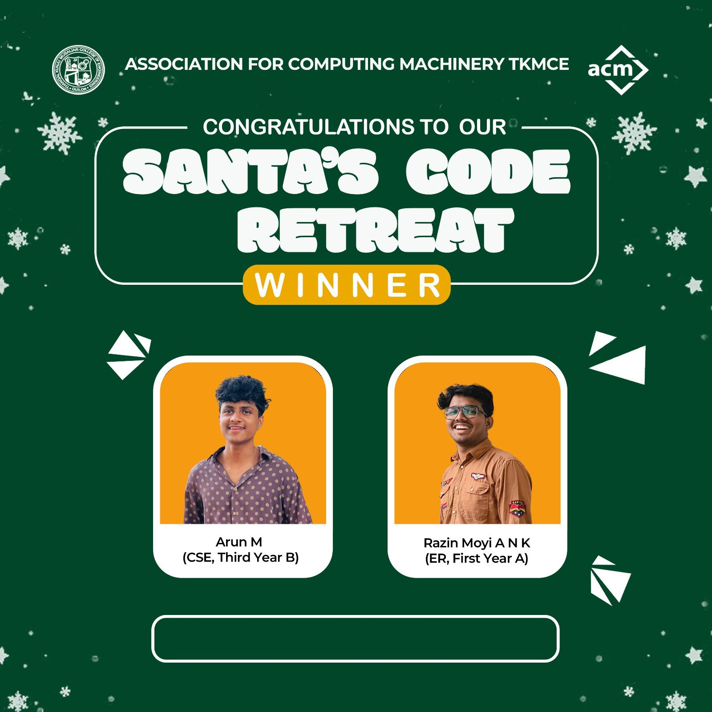
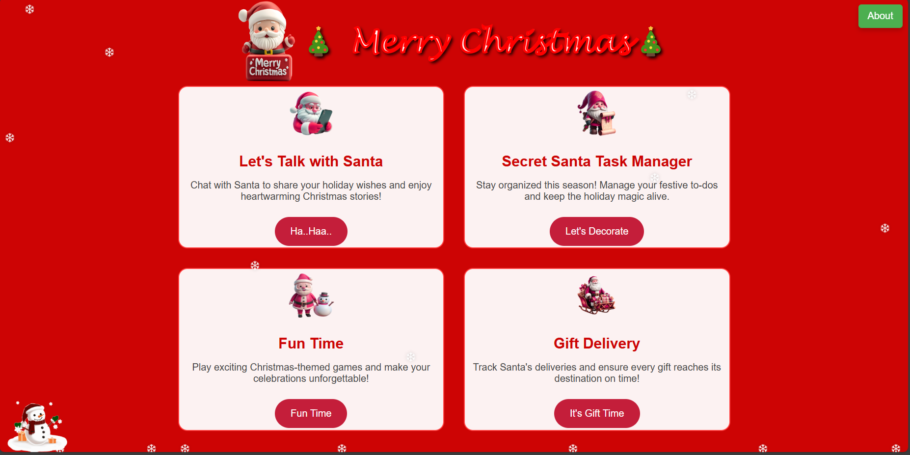
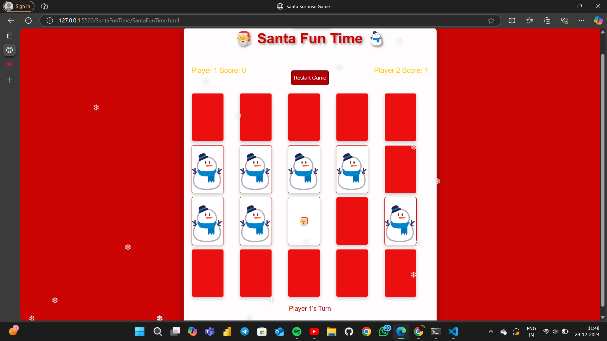
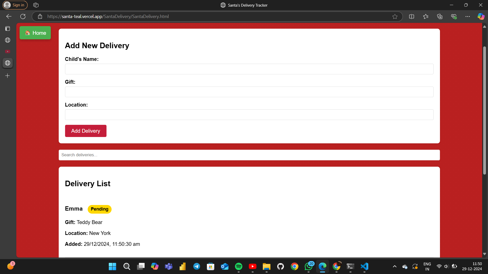

Hey everyone!  After an exciting contest of Santa's Code Retreat conducted by ACM TKMCE, we're thrilled to announce the winning team:

Razin Moyi A N K (First Year ER Batch A)
Arun M (Third Year CS Batch B)

Kudos to all the participants for their active participation and enthusiasm! We can't wait to see y'all for the next event!✨

# Santa
<h1>Santa's Workshop Project Documentation</h1>
link to website:<a href="https://santa-teal.vercel.app/">click Me</a>

Team 8
Razin Moyi A N K (ER, First Year A)   
Arun M (CSE, Third Year B)  

Abstract

Christmas is a time for joy and coming together, yet many people experience the bitter reality of missing their families because of work or studies. This is stressful, lonely, and makes one feel cut off from the world during what should be a season of celebration. In response to this, we come up with an innovative app to bring Christmas magic to all, regardless of where they are.

The app has three core sections:

 1. Santa AI Chat: A conversational Santa Claus powered by generative AI offers empathetic, uplifting interactions to relieve stress and combat loneliness. This feature serves as a virtual companion, providing personalized holiday wishes, motivational talks, and engaging storytelling.

2.santa's To-Do List : A dynamic activity tracker to help Santa (and users) organize tasks, mark them as done, and ensure all activities are accounted for, promoting productivity in a festive manner. 
 
3. delivery tracker : A robust system that visualizes the status of deliveries with categories like "To Be Delivered," "On the Way," and "Delivered," ensuring a smooth and transparent tracking process.

4. Santa Surprise Game: A two-player interactive game where players compete to uncover hidden Santa cards from a shared set. The first player to find three Santa cards wins. This feature combines memory and luck, creating a fun and engaging way to connect with friends during the holiday season.

This application not only gives emotional support to those separated from their families but also introduces a fun, interesting way of managing holiday tasks and deliveries. By integrating the latest AI technology with practical tools, the app delivers a comprehensive solution for making sure no one is left out during the Christmas season.

Project Overview
Santa's Workshop is an interactive web application designed to spread holiday cheer and assist users in their Christmas preparations. The website features a collection of fun and heartwarming tools including a chatbot, task manager, surprise game, and delivery tracker. Whether you're feeling lonely during the holidays or need help organizing your Christmas tasks, this project has something to bring a smile to your face.

Features
1. 🤖 AI Santa Chatbot
This feature provides a warm, friendly AI-powered Santa to chat with, offering company to users who may be feeling lonely or isolated during the Christmas season. The chatbot is available to anyone who needs a little extra holiday cheer.

How to Use:
Talk to Santa: Start a conversation with a simple greeting like "Hi, Santa!" or anything else that feels festive.
Share Your Feelings: Santa is always ready to listen, offering a kind ear to brighten your day.
Get Holiday Tips: Receive tips, heartwarming Christmas stories, and festive advice to help you feel the magic of the season.

2. 📝 Secret Santa Task Manager
This tool allows users to easily organize their Christmas preparations. From planning to execution, the Secret Santa Task Manager helps users keep track of important holiday tasks and ensures nothing is missed.

Key Features:
Add Tasks: Easily add tasks to your Christmas to-do list.
Track Progress: Mark tasks as complete with a simple click of a button.
Organize: Filter tasks based on their status (active, completed, all).
Remove Tasks: Delete unnecessary tasks when they’re no longer needed.

3. 🎮 Santa Surprise Game
An exciting two-player game where participants compete to uncover Santa cards hidden among snowman cards. It's a fun way to bring friends and family together in a friendly, festive competition.

Game Rules:
Objective: Be the first to uncover three Santa cards to win.
Gameplay: Players take turns flipping cards to reveal either a Santa 🎅 or Snowman ⛄ card.
Scoring: One point is awarded for each Santa card found.
Victory: The first player to score three points wins the game.
Replay: The game can be restarted at any time by clicking the restart button.

4. 🚚 Delivery Tracker
The Delivery Tracker helps users manage and monitor Christmas gift deliveries, providing an easy and efficient way to keep track of the status of all deliveries.

How the Delivery Page Works:
Adding Deliveries: Users can easily enter recipient details such as name, gift, and location through a simple form.
Tracking Status: Deliveries can be tracked as "Pending" (Yellow) or "Delivered" (Green) to provide clear progress updates.
Updating Status: Delivery statuses can be toggled between "Pending" and "Delivered" by clicking on the status badge.
Searching Deliveries: A search bar is available to quickly find deliveries by recipient name, gift, or location.
Persistent Data: All entered delivery information is saved and accessible even after refreshing the page, ensuring no data is lost.

Conclusion
Santa’s Workshop is a comprehensive web application built to help users embrace the holiday spirit. From chatting with Santa to organizing tasks and tracking gift deliveries, this project offers a range of features to spread Christmas joy. Whether you're looking for a festive companion, trying to stay organized during the busy season, or playing a fun game with friends, Santa’s Workshop brings all of this together in one magical place.

Technologies Used
HTML/CSS: For structuring and styling the website.
JavaScript: To manage dynamic functionalities such as chat interactions, task management, game mechanics, and delivery tracking.
API Integration: For implementing the AI chatbot and ensuring persistent data storage in the delivery tracker.
Future Enhancements
User Authentication: Add user accounts for personalized experiences and saving progress on tasks and games.
Additional Games and Activities: Introduce more interactive Christmas-themed games to entertain users.
Notifications: Implement notifications for upcoming deliveries or pending tasks to help users stay on top of their holiday preparations.
  